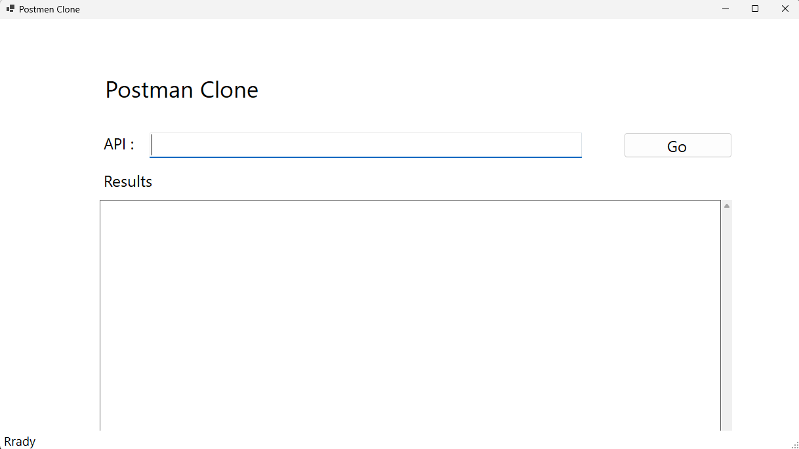
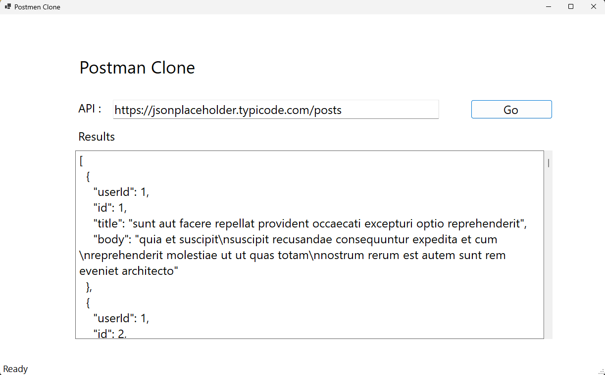

# PostmenCloneApp
Postman Clone provides a user-friendly Interface for making GET requests to APIs and viewing the responses in formated JSON Ideal for Dev and Testers , this tool Simplifies API interaction and debuging , helping you effciently validate and troubleshoot your API calls.

## Technologies Used
* C#
* .NET 8
* WinFroms
* HttpClient

## Using The App
1. Download the executable file from the release section.
2. When the application launches, it shoud look like this:

3. Fill in your APi URL and hit GO:

## Upcoming Changes
* Adding POST, PUT, PATCH, DELETE funcationality
* Adding API headers
* Handling API authencation
* Adding Dependency Injection
* Adding Login
* Create a Web based User Interface
